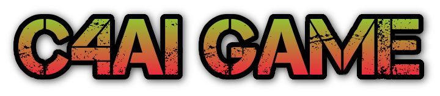

</img>

C4AI is the University of Helsinki's Data Structures Lab 2022 course project. C4AI refers to board game called Connect Four and the goal for this project is to create AI which plays Connect Four computer game against the player.


[](https://codecov.io/gh/TopiasHarjunpaa/C4AI)


## Releases

- [Week 4 -release](https://github.com/TopiasHarjunpaa/C4AI/releases/tag/week4)

## Documentation

- [Project definition document](https://github.com/TopiasHarjunpaa/C4AI/blob/main/documentation/definitions.md)
- [Project implementation document](https://github.com/TopiasHarjunpaa/C4AI/blob/main/documentation/implementation.md)
- [Testing document](https://github.com/TopiasHarjunpaa/C4AI/blob/main/documentation/testing.md)
- [User instructions](https://github.com/TopiasHarjunpaa/C4AI/blob/main/documentation/instructions.md)

## Reports and hours

- [Week 1](https://github.com/TopiasHarjunpaa/C4AI/blob/main/documentation/weekly_report_1.md)
- [Week 2](https://github.com/TopiasHarjunpaa/C4AI/blob/main/documentation/weekly_report_2.md)
- [Week 3](https://github.com/TopiasHarjunpaa/C4AI/blob/main/documentation/weekly_report_3.md)
- [Week 4](https://github.com/TopiasHarjunpaa/C4AI/blob/main/documentation/weekly_report_4.md)
- [Week 5](https://github.com/TopiasHarjunpaa/C4AI/blob/main/documentation/weekly_report_5.md)
- [Week 6](https://github.com/TopiasHarjunpaa/C4AI/blob/main/documentation/weekly_report_6.md)
- [Hours](https://github.com/TopiasHarjunpaa/C4AI/blob/main/documentation/hours.md)

## Assembly instructions

Start by cloning the repository:

```
$ git clone git@github.com:TopiasHarjunpaa/C4AI.git
$ cd C4AI
```

Install dependencies

```
$ poetry install
```

Start the program using the command:

```
$ poetry run invoke start
```

## Other commands

#### Testing:

Tests can be executed using the command:

```
poetry run invoke test
```

Coverage report can be generated using the command:

```
poetry run invoke coverage-report
```

Report will be generated into the folder named `htmlcov`. Coverage report can be also found from the [Codecov](https://app.codecov.io/gh/TopiasHarjunpaa/C4AI). Some of the files are left out from the coverage report such as files related to the UI and testing along with configuration-, simulation- and index- files.

#### Pylint:

Style checks can be executed using the command:

```
poetry run invoke lint
```

## Credits

Font style:
* Loaded from the website [dafont](https://www.dafont.com/no-virus.font)
* Author **Khurasan**

C4AI logo:
* Generated from the website [Cooltext](https://cooltext.com/)